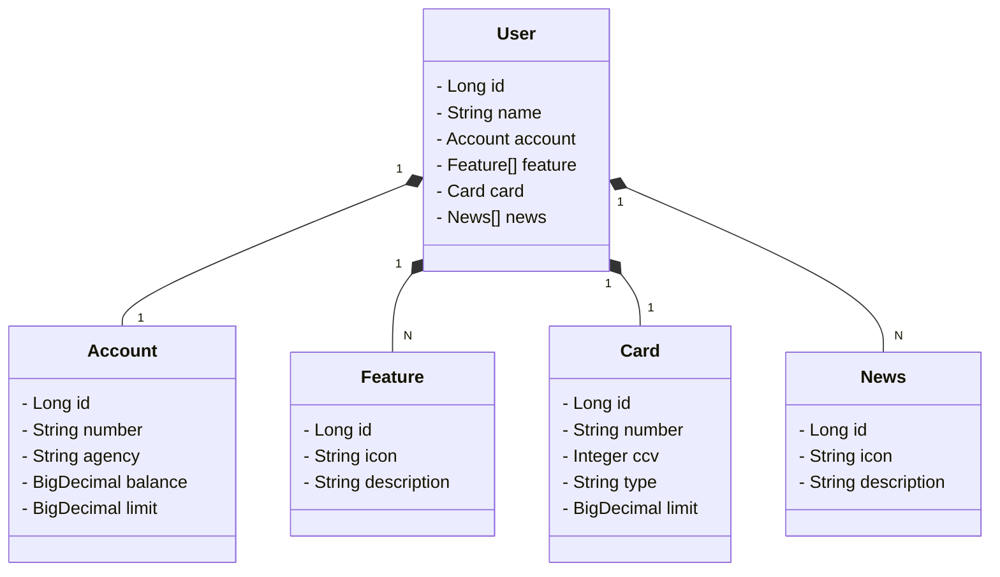

# API RESTful DIO Santander 2025

## Diagrama de Classes


# 🧠 RestNuvem API

API RESTful criada com Spring Boot para gerenciamento de usuários, contas, cartões, funcionalidades e notícias.

---

## 🚀 Tecnologias Utilizadas

- Java 17
- Spring Boot
- Spring Data JPA
- H2 Database (ambiente dev)
- PostgreSQL (produção)
- Docker
- Heroku (deploy)
- Lombok

---

## 📂 Estrutura do Projeto

```
src/
├── main/
│   ├── java/com/champs/restNuvem/
│   │   ├── RestNuvemApplication.java        # Classe principal
│   │   ├── domain/
│   │   │   ├── model/                       # Entidades (User, Account, Card, Feature, News)
│   │   │   ├── controller/                  # Controladores REST (UserController)
│   │   │   ├── repository/                  # Repositórios JPA
│   │   │   ├── service/                     # Interfaces de serviço
│   │   │   └── service/impl/                # Implementações de serviço
│   ├── resources/
│   │   ├── application-dev.yml             # Configurações para ambiente dev (H2)
│   │   └── application-prd.yml             # Configurações para produção (PostgreSQL)
│
├── Dockerfile                               # Containerização da aplicação
├── Procfile                                  # Configuração para deploy no Render
```

---

## ▶️ Como Rodar Localmente

1. **Clone o repositório:**
```bash
git clone https://github.com/champs-8/restnuvem.git
cd restnuvem
```

2. **Configure o ambiente:**

- Use o perfil `dev` para testar com H2:
```bash
./mvnw spring-boot:run -Dspring-boot.run.profiles=dev
```

3. **Acesse o H2 console (ambiente dev):**  
[http://localhost:8080/h2-console](http://localhost:8080/h2-console)  
Use as credenciais definidas no `application-dev.yml`.

---

## 📌 Endpoints da API

| Método | Endpoint         | Descrição                  |
|--------|------------------|----------------------------|
| GET    | `/users/`        | Verifica o status da API   |
| GET    | `/users/{id}`    | Busca um usuário por ID    |
| POST   | `/users`         | Cria um novo usuário       |

Exemplo de `POST /users`:

```json
{
  "name": "João",
  "account": {
    "number": "12345-6",
    "agency": "0001",
    "bank": "Banco XPTO"
  },
  "card": {
    "number": "1111-2222-3333-4444",
    "type": "CREDIT"
  },
  "feature": [
    { "name": "Transferência" }
  ],
  "news": [
    { "description": "Nova função ativa!" }
  ]
}
```

---

## ⚙️ Configurações por Ambiente

- `application-dev.yml`: usa banco H2 em memória para testes locais.
- `application-prd.yml`: pronto para produção com PostgreSQL.

---

## 🐳 Docker

Crie a imagem Docker da aplicação:

```bash
docker build -t restnuvem-api .
docker run -p 8080:8080 restnuvem-api
```

---

## ☁️ Deploy no Render

A aplicação possui um `Procfile` para facilitar o deploy no Render:

```bash
render create
git push render main
```

---

## 💥 Tratamento de Erros

A classe `GlobalExceptionHandler` lida com exceções como:

- Usuário não encontrado (`EntityNotFoundException`)
- Conta já existente (`IllegalArgumentException`)

---

## 👥 Contribuindo

Pull requests são bem-vindos! Para mudanças maiores, abra uma issue antes para discutir o que você gostaria de mudar.

---

## 📝 Licença

Este projeto está sob a licença MIT.
